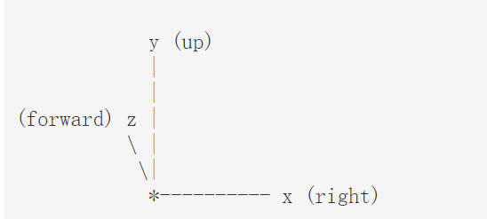

# 一、项目介绍

## 1.1 编程环境

- python 3.9

- ursina 5.2.0

## 1.2 ursina模块安装

安装

```
pip install ursina -i https://pypi.tuna.tsinghua.edu.cn/simple
```


# 二、 关键知识

**dumention：**https://www.ursinaengine.org/documentation.html

**API Refenrence**：https://www.ursinaengine.org/api_reference.html


## 2.1 简单窗口实现

导入ursina库，用Ursina这个函数实例化一个app的对象，调用run的方法，把窗口跑起来

```
from ursina import *

app = Ursina()
app.run()
```

运行结果：


右上角显示的是实时的的帧率


## 2.2 Entity坐标系

**Entity Coordinate System**




# 三、项目创建

## 3.1 创建简单方块以及简单地图


## 3.2 第一人称视角

简单的一行代码即可实现

```
player = FirstPersonController()
```

完整的代码：

```
from ursina import *
from ursina.prefabs.first_person_controller import FirstPersonController

app = Ursina()

# 实现第一人称视角
player = FirstPersonController()

app.run()
```


## 3.3 天空

该函数必须放在主函数，否则会报错

```
class Sky(Entity):
    def __init__(self, texture_sky=None):
        super().__init__(
            parent=scene,
            model='sphere',
            texture=texture_sky,
            scale=random.randrange(200,300),
            double_sided=True
        )
```


# 四、参考资料

[_哔哩哔哩bilibili_我的世界](https://www.bilibili.com/video/BV1BM411e7BZ/?spm_id_from=333.788&vd_source=52cd9a9deff2e511c87ff028e3bb01d2)

[我的世界CSDN 博客](https://blog.csdn.net/leleprogrammer/article/details/124781130)